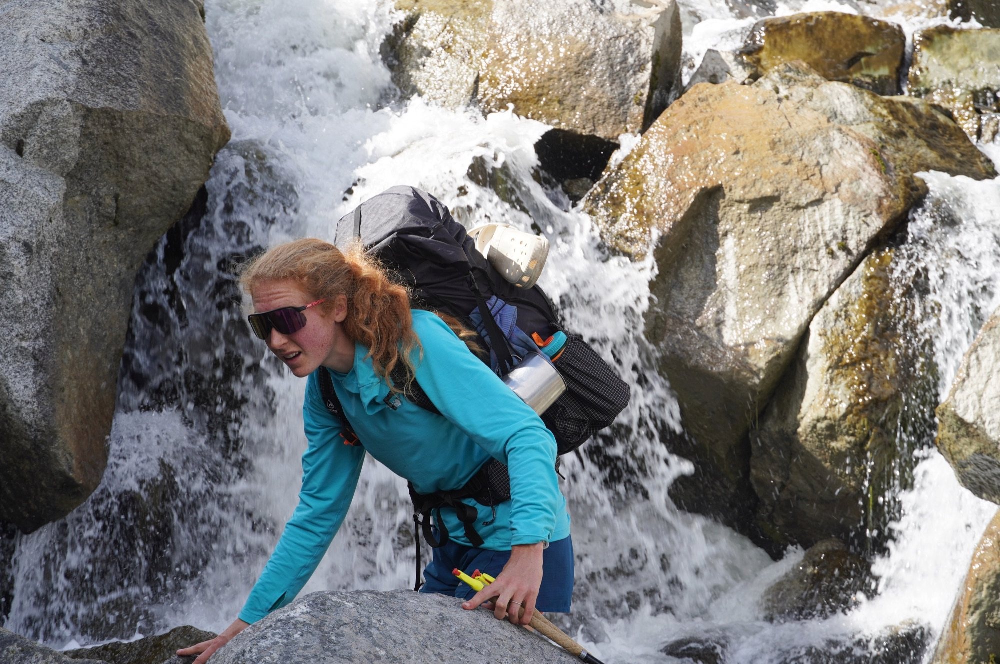
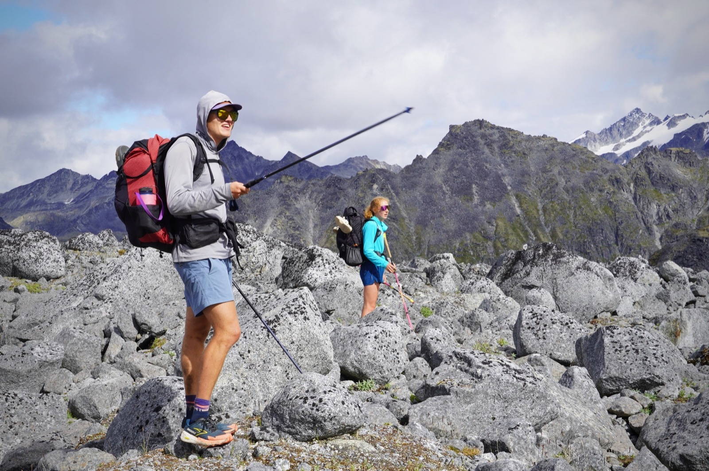

## History

On November 15, 1957, the TB-29 was returning to Elmendorf Air Force Base just north of Anchorage after a radar-calibration mission. The weather had deteriorated badly, and the crew was flying through clouds and snow in the Susitna Valley.

They were about 27 miles off course without realizing they had entered the Talkeetna Mountains. At about 6:22 p.m., the aircraft struck an unnamed glacier at roughly 5,600. There were 10 men aboard. Six died in the crash, including the pilot and several officers. Four survived and were eventually found and rescused by helicopter off the glacier. 
Nearly seven decades later the remnants of the crash are still visable and have become the namesake of the “Bomber Glacier”. And for those that enjoy the sport of walking the Bomber travese is a 20 mile loop that cricumnavigates that glacier. 

## Context
Fiance Mary is working as Public Defender in Palmer Alakska this summer. I came out to vist for her final two weeks in Alaska. On Friday, Aug 21st I caught an Uber from my work in San Carlos, CA to the SFO airport and flew directly to the Anchorage Airport where Mary was generous enough to pick me up at ~11PM. We drove back to her apartment in Palmer where we found one Gus Robinson, asleep. Gus graduated in June and was enjoying a summer of adventure prior to starting a big boy job in SF at the end of August.

Prior to flying to Alaska, Mary, Gus, and I had made loose plans to hike the Bomber traverse in three days. However, we decided to make the final go no-go call once we were all in Alaska and the weather forecast was more certain. 

So the Saturday morning we woke up, looked at the forecast, ate some scrambled eggs, and decided to go for it. We would hike in Gold Mint Trailhead and stay one night at Mint hut and then continue counterclockwise around the traverse exiting out of the Reed Lakes trailhead. The plan decided, we made the following packing decisions: 
- We carried one tent in case the huts proved to be crowded or smelly for our liking.
- Between the three of us we carried two pairs of crampons and one pair of light weight microspikes. 
- We carried two bear cans which given the existence of huts along the route were probably wholly unnecessary. At least we would sleep soundly knowing that our food was protected from any critters by rigid plastic and double locking lid. 

Our first stop on the way out of town was a local burrito spot; however we timed our visit to arrive shortly after a girls softball team and therefore decided to go to plan B: Taco Bell. Taco Bell the restaurant turned out to be closed, but Taco Bell the drive through was open. Gus and I each purchased two chicken burritos and Mary got a Melt. 
The second stop out of town was to stop at the NOLs used gear sale. The NOLs Alaska program is based out of Palmer and they happened to be having used gear sales that Mary heard about. We purchased one pair of rain pants (Gus had not packed his) and two mismatched rain boots for the net total of $0. 

## Trailhead -> Mint 
We started our walk under cloudy but dry skies at 11 AM. The trail up the valley was in reasonably good condition except for the spots where beavers had dammed the creek causing the trail to flood. 

*Mary and Gus along Little Susitna River.*

{: width="50%" .align-center }
*We walked up the valley before cutting up left to a local promontory point..*

*Dropping down towards Mint Hut.* 

At the hut we were greeted by a friendly group of four girls from Bend, OR who were doing our route in reverse over four days. In addition to staying at Mint and Snowbird, they also spent a night at Bomber which we planned to skip over entirely. The lead stoker of their group was a big whitewater Kayaker, so she and Gus chatted about boating while we made quesadillas in the Jetboil. We also learned that one of their group members had gone to college in Durango (Go Skyhawks!) and still worked in the outdoor education program there despire residing in Bend. 

With rainy skies the hut was a bit chilly, so we retreated to our sleeping bags —  Mary and Gus read while I passed out for about two hours. 

*Cozy sleeping quarters."

And then it was dinner time! The overall review of Taco Bell for dinner burritos is 3 stars. Perfectly adequate but uninspired.

While we were eating, two girls from Soldotna arrived. One was a lawyer in Anchorage and the other a Masus in Wasilla. They carry an ultralight stove setup with a small titanium put and packet rocket. However, whatever grams they saved with that setup were lost by the boxed wine and small dog they had also brought. 

We learned about work as a prosecutor in Anchorage and also talked about Dungeon Crawler Carl, a series that about half of the hut (Gus, two of the girls from Bend, and the younger sister from Soldtna) were all reading. 

No big snores in the group and we all slept well. The noisiest part of the night was Gus and I squeaking with our Thermorest inflatable pads. 

## Mint -> Snowbird 
The next morning it dawned clear. Walking outside the hut we were able to get a good look at the valley we had come from the day before. After a quick breakfast of oats (classic 200g per person) and usage of the outhouse (we donated to Alaska Alpine Club to support the pood bin removals) we were on the move. 

The scramble up to Backdoor Gap was pretty straightforward. The day was clear enough to have a nice view of Denali! 

*Denali peaks out behind us while we pose for the self timer.*

From the gap there was a fixed rope that we used to descend down onto the glacier which was gentle. Gus and I put our microspikes on, but Mary didn't bother. 

*Easy walking.*

We ate lunch at Bomber hut which is the smallest of the three, it certainly had plenty of space for our group but would have become crowded if a second group arrived. 

*Departing Bomber."

From Bomber, we continued down the valley on mostly pretty good trails until we arrived at the creek following down from the Snowbird Glacier and turned left to walk up it. The crux of the climb to Snowbird was likely scrambling up Snowbird creek to gain the ridge adjacent to the Snowbird Glacier where the hut was built. Gus took an easier lower line, but Mary’s line was a better photo opportunity. 

*The referenced photo opportunity.*

*Gus and Mary exhibt there classic adventure expressions.*

*Snowbird hut is a stunner.*

The most that can be said against it is that it was built for snow recreation and as a result there is no water nearby. After we arrived, Mary and I walked down to the glacier to fill up all our water vessels and a pot. 

*Mary's uperbody workout for the day.*

The hut overlooks the Snowbird Glacier and we had a pleasant afternoon reading old trip logs that tell amusing tales of nearby hotsprings and playing chess on the mini chess board in the hut (Paxton 2 Mary 1). 

*Looking back down the valley we walked up.*

As we were cooking dinner, two ladies arrived who had walked from the Reed Lakes trailhead. One was from Anchorage while the other lived in Colorado but they had met originally working at a research station in Greenland. Despite seemingly having plenty of material, my attempts to get a conversation going were largely unsuccessful. The best start was a discussion of Endurance (I had the paperback copy with me) but after talking about Elphant Isle grew stale the ladies returned  to their card game and Gus, Mary and I returned to our own conversation. 

Two other folks arrived late ~9PM. Mary was already asleep but I learned  the new couple both went to school at Davis and where working in Talkettna for the summer —  the guy as a hiking guide and the woman in a coffee shop. They were both climbers and had spent much of the previous year in Trukee! Small world. After chatting for a moment they very politely went to cook dinner outside to (I assume) avoid waking our sleeping companions. 

## Snowbird -> Out
In the morning I used the outhouse which claimed to be of a revolutionary design (at least as of 2002) that does not require poop barrels. The sign also on the outhouse door requested that each user donate $2 dollars to contribute to helicopter lifting the waste at the end of the season. 

We made oats and departed the hut before the other groups woke up. The weather was cloudier than the day before but still much nicer than I had expected we would see in Alaska in late August. 

*Cloudy day.*

The walk up the glacier was chill, the pass was chill, and the descent down from the pass was on a very good trail. We made it back to the Reed Lakes trailhead in about 3 hours and then another hour of dirt road walking back to the car. 

A very successful trip! 

## Notes 
- Should have packed more cheese. 
- Given that we never used our tent, it would have been nicer to carry a lighter alternative to the four season 8-lb Norwegian behemoth I ended up lugging. But that was the only tent we had with us in AK and we didn’t feel bold enough to go with no tent. 

